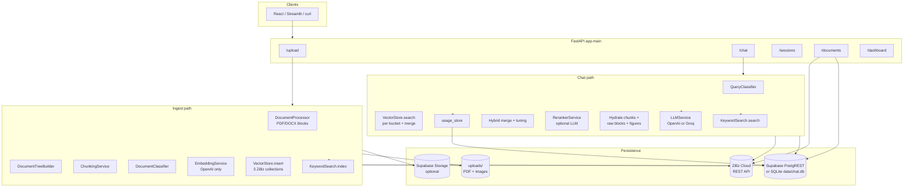
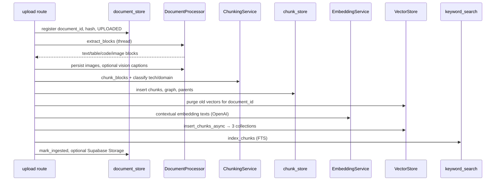
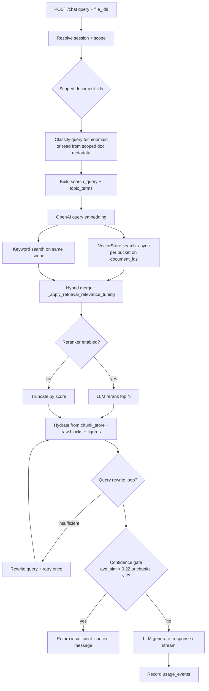

# Backend — PDF Chatbot API

FastAPI service for **Retrieval-Augmented Generation (RAG)** over PDFs/DOCX: ingest → index → hybrid retrieval → grounded LLM answers. The React UI is in [`../web`](../web). Monorepo overview: [`../README.md`](../README.md).

---

## Table of contents

1. [System architecture](#system-architecture)
2. [Data storage model](#data-storage-model)
3. [Application layers](#application-layers)
4. [Ingest pipeline](#ingest-pipeline)
5. [Chat & retrieval pipeline](#chat--retrieval-pipeline)
6. [Document lifecycle & purge](#document-lifecycle--purge)
7. [HTTP API](#http-api)
8. [Configuration](#configuration)
9. [Quick start](#quick-start)
10. [Testing & evaluation](#testing--evaluation)
11. [Deploy & troubleshooting](#deploy--troubleshooting)

---

## System architecture

The backend is a **single FastAPI process** that orchestrates external services (OpenAI, Zilliz, optional Groq, optional Supabase) and local disk. There is no separate worker queue: upload and chat run **inline** in request handlers (ingest uses `asyncio` + thread pool for CPU-heavy steps).



**Design principles**

| Principle | How it is implemented |
|-----------|-------------------------|
| **Typed vectors** | Text, code, and table chunks go to **separate** Zilliz collections so code/table queries are not drowned by prose. |
| **Canonical chunks in SQL** | `chunks` table is source of truth for text, metadata, `chunk_id`; vectors are search indexes. |
| **Raw payloads beside chunks** | Full tables/code/images in `raw_*` tables; chat **hydrates** them into the LLM prompt. |
| **Scope by document** | Chat searches only `file_ids` / session scope / all ingested docs — never the whole internet. |
| **Grounded answers** | System prompt + retrieval confidence gate; optional query rewrite if context looks insufficient. |

---

## Data storage model

### 1. Relational / metadata (Supabase or SQLite)

Selected at runtime by `database.py`: if `SUPABASE_URL` + `SUPABASE_KEY` are set → **Supabase** (PostgREST); else **SQLite** at `data/chat.db`. Schema: [`supabase_schema.sql`](supabase_schema.sql).

| Table | Role |
|-------|------|
| `documents` | Registry: `document_id`, `file_hash`, `status`, `technology`, `domain`, `chunk_count`, `pdf_path` |
| `chunks` | Every searchable unit: `chunk_id`, `document_id`, `chunk_type`, `retrieval_text`, page/section, `metadata_json` (links to raw blocks, parent/child, sequence) |
| `chunks_fts` | Keyword / BM25-style search index (denormalized text + routing fields) |
| `raw_tables` | Full table JSON per `table_id` |
| `raw_code_blocks` | Full source per `code_id` |
| `raw_images` | Image path, caption, page |
| `document_nodes` / `document_edges` | Section tree + cross-type graph (Phase 1–2) |
| `chat_sessions` / `chat_messages` | Conversation history |
| `session_documents` | Many-to-many: which PDFs a session may use |
| `usage_events` | Token counts and optional USD per chat completion (dashboard) |

**Parent–child retrieval:** Ingest creates **section parent** rows (stored in `chunks`, not embedded in Zilliz). Search hits **child** chunks in Zilliz; at chat time `parent_context_resolution` can replace/expand with parent section text (`ENABLE_PARENT_CHILD_RETRIEVAL`).

### 2. Vector store (Zilliz Cloud)

- Config base name: `ZILLIZ_COLLECTION_NAME` (e.g. `pdf_chatbot_collection`).
- **Three derived collections** (REST via `httpx`, not pymilvus):

| Collection suffix | Chunk types indexed |
|-------------------|---------------------|
| `{base}_text_chunks` | paragraph, heading, list, **image_caption**, etc. |
| `{base}_code_blocks` | code summaries (full code in `raw_code_blocks`) |
| `{base}_tables` | table summaries (full table in `raw_tables`) |

Each vector row stores: embedding, `chunk_id`, `document_id`, `technology`, `domain`, `file_id`, chunk index, optional metadata JSON.

**Search:** `VectorStore.search()` runs **one ANN query per bucket**, allocates `top_k` by query intent (code vs table vs figure wording), merges, re-scores, returns global top‑k.

**Insert rollback:** If any bucket insert fails, vectors for that `document_id` are deleted across all buckets before the error propagates.

### 3. Files on disk

| Location | Content |
|----------|---------|
| `uploads/{document_id}.pdf` | Original PDF (when `STORE_PDF_AFTER_INGEST`) |
| `uploads/images/{document_id}/` | Cropped figures per page (`STORE_EXTRACTED_IMAGES`) |

Optional **Supabase Storage** (`blob_storage.py`, `USE_SUPABASE_STORAGE`): uploads PDF + images to bucket `SUPABASE_STORAGE_BUCKET`; `documents.pdf_path` may point to storage URL.

### 4. What is *not* stored in Zilliz

- Chat messages (SQL only).
- Full raw table/code bodies (SQL `raw_*`; only summaries in vectors).
- Section **parent** chunks (SQL only; used after retrieval).
- Session scope (SQL `session_documents`).

---

## Application layers

```
HTTP Request
    │
    ▼
app/api/routes/          ← Thin controllers: validate, call services, return schemas
    ├── upload.py        ← Multipart ingest, batch, duplicate check
    ├── chat.py          ← RAG turn (sync + stream), scope, retrieval, hydration
    ├── sessions.py      ← CRUD sessions + scoped document ids
    ├── documents.py     ← Library list/delete/replace
    └── dashboard.py     ← usage_events aggregates
    │
    ▼
app/services/            ← Business logic
    ├── ingest_pipeline.py      ← Async ingest orchestration
    ├── document_processor.py   ← PDF/DOCX → blocks
    ├── document_tree.py        ← Hierarchy + reading order
    ├── chunking.py             ← Block-aware chunks + metadata
    ├── document_classifier.py  ← technology / domain tags
    ├── embedding.py            ← OpenAI embeddings (sync + async)
    ├── vector_store.py         ← Zilliz facade (3 collections)
    ├── keyword_search.py       ← FTS / Supabase / SQLite
    ├── chunk_store.py          ← chunks table CRUD
    ├── raw_block_store.py      ← raw_tables / code / images
    ├── document_graph_store.py ← nodes + edges
    ├── query_classifier.py     ← Route chat queries by tech/domain
    ├── reranker.py             ← LLM passage reranking
    ├── llm.py                  ← RAG prompt + completion
    ├── chat_service.py         ← Sessions + messages
    ├── document_store.py       ← documents registry
    ├── document_purge.py       ← Coordinated delete across stores
    ├── figure_serving.py       ← Image URLs + relevance for chat
    ├── graph_context_expansion.py  ← Optional linked chunks at query time
    ├── parent_child_chunks.py / parent_context_resolution.py
    ├── usage_store.py          ← Dashboard token rows
    └── blob_storage.py         ← Supabase Storage uploads
    │
    ▼
app/config.py            ← pydantic-settings from .env
app/models/schemas.py    ← Pydantic API models
```

**Singletons / lazy init:** Vector store and some LLM clients are created on first use (`get_vector_store()` in `upload.py`, `get_*` in `chat.py`) so a bad Zilliz config does not crash import time.

---

## Ingest pipeline

**Entry:** `POST /upload/` or `POST /upload/batch` → save bytes → `document_store` row → `ingest_document_async()` in [`ingest_pipeline.py`](app/services/ingest_pipeline.py).



| Step | Module | What happens |
|------|--------|----------------|
| 1 | `upload.py` | SHA-256 duplicate check; reject if same `file_hash` already ingested |
| 2 | Disk | Save `uploads/{document_id}.pdf` (or .docx) |
| 3 | `DocumentProcessor` | **Blocks**: typed units (paragraph, heading, table, code, image) with page/section |
| 4 | `DocumentTreeBuilder` | Build `document_nodes` / `document_edges` (hierarchy) |
| 5 | `DocumentClassifier` | `technology` + `domain` from filename + content (heuristic or LLM mode) |
| 6 | `ChunkingService` | Split blocks into chunks; attach metadata (`chunk_type`, `raw_*_id`, page, section) |
| 7 | `chunk_store` | Assign `chunk_id`, sequence links, Phase-2 cross-type edges; insert **children** + **section parents** |
| 8 | `purge_index_data_async` | Remove prior FTS, SQL chunks, raw blocks, Zilliz rows for this `document_id` (re-ingest safe) |
| 9 | `embedding.py` | Embed **searchable children only** (`split_searchable_for_index`); optional contextual prefixes on embed text |
| 10 | `VectorStore` | Route each chunk to text/code/tables collection; batched REST insert |
| 11 | `keyword_search` | Populate `chunks_fts` (or Supabase equivalent) |
| 12 | `document_store` | `status=INGESTED`, `chunk_count`; optional `blob_storage.upload_document_assets` |

**Failure cleanup:** On ingest error after partial work, `best_effort_clear_failed_ingest` removes SQL + FTS + Zilliz for that id so you do not leave orphan index rows.

---

## Chat & retrieval pipeline

**Entry:** `POST /chat/` → [`chat.py`](app/api/routes/chat.py) `_rag_turn_async()` (used by sync and streaming responses).



| Stage | Detail |
|-------|--------|
| **Scope** | `file_ids` from body → else `session_documents` → else all ingested if `CHAT_AUTO_SCOPE_ALL_INGESTED` |
| **Classification** | Prefer **ingest tags** from scoped PDFs; else `QueryClassifier` + conversation narrowing |
| **Retrieval** | Pooled search over `document_ids` (cap `CHAT_SCOPED_POOL_MAX_DOCUMENTS`); multi-tech uses balanced per-tech passes + global rerank |
| **Fallbacks** | Empty results → drop domain filter → document-wide search without tech filter (scoped docs only) |
| **Hybrid** | `HYBRID_VECTOR_WEIGHT` / `HYBRID_KEYWORD_WEIGHT`; scores normalized in `_merge_hybrid_results` |
| **Reranker** | `RERANK_INITIAL_TOP_K` → LLM orders passages → keep `RERANK_TOP_N` |
| **Hydration** | Reload chunk text + attach **RAW TABLE / CODE / IMAGE** for LLM; parent-child expansion; optional `graph_context_expansion` |
| **Figures** | `figure_serving` builds `view_url` paths; vision-caption chunks boosted for diagram queries |
| **Rewrite** | `ENABLE_QUERY_REWRITE`: `llm.is_context_sufficient` → `rewrite_query` → one retry |
| **Answer** | `LLMService` builds strict grounded system prompt; Groq paths cap context via `GROQ_MAX_*` |
| **Usage** | `record_chat_completion` → `usage_events` (main completion tokens only) |

If Zilliz is unavailable at chat time, the route can fall back to **keyword-only** search when `ENABLE_KEYWORD_SEARCH` is true.

---

## Document lifecycle & purge

| Action | Route | Behavior |
|--------|-------|----------|
| List | `GET /documents/` | Rows from `documents` |
| Delete | `DELETE /documents/{id}` | `document_purge.purge_document_everywhere_async`: Zilliz (3 collections), `chunks`, FTS, raw blocks, graph, session links, local files, storage objects |
| Replace | `POST /documents/{id}/replace` | Same `document_id`, new file → full re-ingest after purge |

Deletes use parallel workers (`DELETE_PARALLEL_WORKERS`) for Zilliz + DB where possible.

---

## HTTP API

| Method | Path | Description |
|--------|------|-------------|
| `GET` | `/health` | Health check |
| `POST` | `/upload/` | Single file ingest |
| `POST` | `/upload/batch` | Parallel batch ingest (`BATCH_UPLOAD_CONCURRENT`) |
| `POST` | `/chat/` | RAG Q&A (`query`, `session_id`, `file_ids`) |
| `GET` / `POST` | `/sessions/` | List / create sessions |
| `GET` / `DELETE` | `/sessions/{id}` | Session detail / delete |
| `GET` / `PUT` | `/sessions/{id}/documents` | Chat document scope |
| `GET` / `DELETE` | `/documents/` | Library |
| `POST` | `/documents/{id}/replace` | Replace PDF, same id |
| `GET` | `/dashboard/usage` | Token usage summary (`days`, `limit`) |

Interactive docs: http://127.0.0.1:8000/docs

---

## Configuration

Copy [`env.example`](env.example) → `.env`. Full defaults: [`app/config.py`](app/config.py).

| Group | Key examples |
|-------|----------------|
| **OpenAI** | `OPENAI_API_KEY`, `OPENAI_EMBEDDING_MODEL` (always used for embeddings) |
| **Chat LLM** | `LLM_PROVIDER=openai\|groq`, `GROQ_*` |
| **Zilliz** | `ZILLIZ_URI`, `ZILLIZ_TOKEN`, `ZILLIZ_COLLECTION_NAME`, insert batch/timeouts |
| **Retrieval** | `ENABLE_RERANKER`, `RERANK_*`, `ENABLE_KEYWORD_SEARCH`, `HYBRID_*` |
| **Chunking** | `CHUNK_SIZE`, `CHUNK_TARGET_TOKENS`, `CHUNK_OVERLAP_PERCENT` |
| **Chat scope** | `CHAT_AUTO_SCOPE_ALL_INGESTED`, `CHAT_SCOPED_POOL_MAX_DOCUMENTS` |
| **Features** | `ENABLE_PARENT_CHILD_RETRIEVAL`, `ENABLE_GRAPH_CONTEXT_EXPANSION`, `ENABLE_QUERY_REWRITE`, `ENABLE_VISION_IMAGE_CAPTIONS` |
| **Supabase** | `SUPABASE_URL`, `SUPABASE_KEY`, `USE_SUPABASE_STORAGE`, optional `SUPABASE_DB_URL` |
| **Classify** | `DOCUMENT_CLASSIFY_MODE`, `DOCUMENT_CLASSIFY_MIN_SCORE` |

---

## Quick start

```bash
cd backend
python -m venv .venv
.venv\Scripts\activate          # Windows
pip install -r requirements.txt
copy env.example .env           # edit keys

uvicorn app.main:app --reload --host 127.0.0.1 --port 8000
```

Windows: `run_backend.bat`. Requires Zilliz cluster **running** (not STOPPED) for ingest/chat vectors.

---

## Testing & evaluation

```bash
pytest tests/ -q
pytest tests/test_eval_metrics.py -v    # eval math only
```

Offline RAG benchmarks (repo [`../eval`](../eval)):

```bash
python run_eval.py --mode retrieval --dataset ../eval/dataset/my_benchmark.json
```

See [`../eval/README.md`](../eval/README.md).

---

## Deploy & troubleshooting

**Render:** Service root = `backend/`, `PYTHON_VERSION=3.12.8`, start `uvicorn app.main:app --host 0.0.0.0 --port $PORT`. See [`render.yaml`](render.yaml).

| Issue | Check |
|-------|--------|
| Zilliz STOPPED | Resume cluster in Zilliz Cloud |
| No retrieval hits | Document ingested? Correct `file_ids`? |
| Groq 413 | Lower `GROQ_MAX_CONTEXT_CHARS`, rerank limits |
| Storage upload failed | `SUPABASE_SERVICE_ROLE_KEY`, bucket policies — [`docs/SUPABASE_STORAGE.md`](docs/SUPABASE_STORAGE.md) |
| RLS errors on ingest | Run [`supabase_rls_policies.sql`](supabase_rls_policies.sql) |

---

## Related documentation

- [Root README](../README.md) — full monorepo, web UI, security
- [Eval framework](../eval/README.md) — precision@k, MRR, faithfulness, latency
- [Supabase storage](docs/SUPABASE_STORAGE.md)
